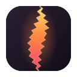

<div align="center">



# rift

**rift** */rɪft/* noun: a crack that splits something apart; an opening between two places.

### Your desk can wait.

RIFT tears a private seam between your phone and your computer, so you can type, point, see your screen and wind it down from the couch or the bed.<br>
No phone app. No account. No cloud. End-to-end encrypted.


</div>

---

## Why "rift"

Sitting at a desk all day is exhausting. But the moment you lie down, your computer is **there** and you're **here**. RIFT opens a seam between the two, and the app is built around that seam:

- **There:** the top of your phone is a live window into your computer. It follows your text while you type and your pointer while you move. Tap the picture to click right there.
- **The seam:** the glowing tear between the two halves. Its light *is* the connection: steady when open, flickering on weak Wi‑Fi, ice when input is frozen, sealed when closed. Every input sends a spark through it. Drag it to resize the window; tap it to fold the window away.
- **Here:** your hands. Your own phone keyboard (autocorrect, swipe, voice), a laptop-grade trackpad, media and wind-down controls, and shortcuts labelled with their real keys.

The logo is the same idea: a dark tile torn open, with light from the other side pouring through.

## ✨ What you can do

| | |
|---|---|
| ⌨️ **Type** | Your phone's keyboard on your computer: autocorrect, swipe, emoji, any language, **voice dictation**. The live view follows your text caret. Sticky ⌃/⌥/⇧/⌘ and a key row with arrows. |
| 🖐️ **Touch** | Acceleration, tap to click, two- and three-finger taps, two-finger scroll with momentum, double-tap-and-hold to drag, a **thumb scroll strip**, hold-able buttons. The live view follows your pointer. |
| 🌙 **Media** | Play/pause, skip, seek, full screen, volume, and **wind down**: a sleep timer that counts down on the seam, screen off, lock, sleep. |
| ⌘ **Keys** | Everyday, browser, system and presentation shortcuts, each showing its key combo, which turns into the Mac version on a Mac. |

Plus: a first-run story that explains the name, day and night themes, left-handed mode, haptics, auto-reconnect and add-to-home-screen.

## 🛡️ Private by design

- **End-to-end encrypted** (NaCl secretbox, XSalsa20-Poly1305) with a separate key for each direction. The key lives only in the QR code's URL *fragment*, which browsers never send over the network.
- **Replay-proof**: every connection answers a fresh challenge, and every message carries an increasing sequence number.
- **Peek is visible and switchable**: the PC shows *"Your phone is viewing this screen"* while Peek is on, with a one-click off switch (also in the tray tooltip).
- **The dashboard is loopback-only**, with a per-launch admin key and DNS-rebinding protection. The firewall rule covers **private networks only**.
- One phone at a time; **New pairing code** revokes every phone paired before.

## 🚀 Getting started

1. Download from [Releases](https://github.com/HarshalPatel1972/rift/releases): **RIFT_Setup.exe** (Windows) or **RIFT.dmg** (macOS 12.3+, drag RIFT to Applications).
2. Open RIFT. Scan the QR code with your phone's camera (same Wi-Fi).
3. Lean back. 🛋️

> **macOS:** the first time, RIFT asks for two switches in System Settings → Privacy & Security: **Accessibility** (to type and click) and **Screen Recording** (only for Peek, which needs macOS 14+). The RIFT window walks you through both and updates live. RIFT lives in the menu bar. On a Mac, your phone shows ⌘ ⌥ ⌃ and Mac shortcuts (Spotlight, Mission Control…).

> **Windows admin apps:** Windows blocks input to apps running as administrator. RIFT warns you when this happens; run RIFT as administrator to control them.

## 🛠️ Architecture

```
 Phone (browser, ES modules)              PC (rift.exe, pure Go)
┌───────────────────────┐  WebSocket/LAN  ┌────────────────────────────────┐
│ typing differ         │  E2E-encrypted  │ internal/server   :8080        │
│ gesture engine        │ ──────────────► │  handshake · sessions · ping   │
│ peek viewer (acks)    │ ◄────────────── │  peek stream (flow-controlled) │
│ tweetnacl             │  JPEG frames    │  sleep timer · actions         │
└───────────────────────┘                 │ internal/injector  SendInput   │
                                          │ internal/screen    GDI capture │
 Dashboard (Edge app window)              │ internal/power     lock/sleep  │
┌───────────────────────┐  loopback only  │ cmd/rift  127.0.0.1:8081       │
│ web/desktop           │ ◄─────────────► │  QR · SSE status · tray        │
└───────────────────────┘  admin key+SSE  └────────────────────────────────┘
```

The wire protocol is documented in [`internal/protocol/protocol.go`](internal/protocol/protocol.go).

## 📦 Building from source

Requirements: **Go 1.26+**.

**Windows** (pure Go, no C toolchain; [NSIS](https://nsis.sourceforge.io/) only for the installer):
```powershell
./build.bat      # tests + rift.exe
./release.bat    # + RIFT_Setup.exe
```

**macOS** (needs Xcode Command Line Tools, since the host uses cgo):
```bash
scripts/macos/build-app.sh                     # universal RIFT.app + RIFT.dmg, ad-hoc signed
SIGN_IDENTITY="Developer ID Application: …" NOTARY_PROFILE=rift scripts/macos/build-app.sh # signed + notarized, for distribution
```
Permissions are tied to the app's signature, so ship with a Developer ID; ad-hoc builds need permissions re-granted after every rebuild.

**Develop the phone UI without touching your PC:**
```powershell
go run ./cmd/riftdev
```
This serves the phone app against a *pretend* PC: input is only logged, and Peek shows a synthetic desktop.

**Tests:** `go test ./...` covers the crypto (against vectors from the phone's own library), the handshake, replay and tamper rejection, key rotation, pausing, takeover by a second phone, Peek flow control, tap-to-point mapping, power actions and the sleep timer, plus real GDI capture and the Win32 struct layouts.

**Landing page:** `site/` is a static page, deployed to GitHub Pages by `.github/workflows/pages.yml`.

**Brand:** `brand/` holds the logo source. `node brand/build-logo.mjs` regenerates the SVGs from the shared tear shape; `node brand/render.mjs` renders every PNG (app icons, favicon, menu bar template); `go run ./cmd/icongen` packs the Windows `.ico`.

## 🗺️ Roadmap

- 🌍 Translations and right-to-left layouts
- 🔒 HTTPS on the LAN, which unlocks wake-lock, an installable app and the gyroscope "air mouse"

## 📄 License

MIT. Bundles [TweetNaCl.js](https://github.com/dchest/tweetnacl-js) (public domain), [Bricolage Grotesque](https://github.com/ateliertriay/bricolage) and [JetBrains Mono](https://github.com/JetBrains/JetBrainsMono) (both SIL OFL 1.1).

<p align="center"><br>Made with 💜 by Harshal Patel</p>
